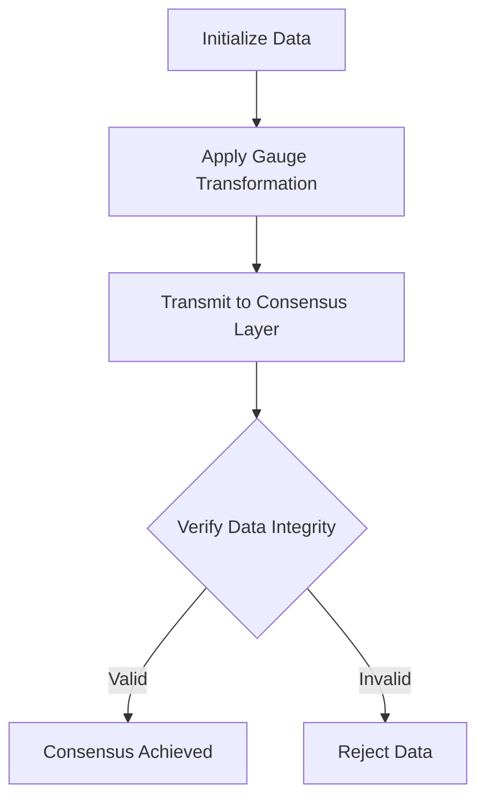
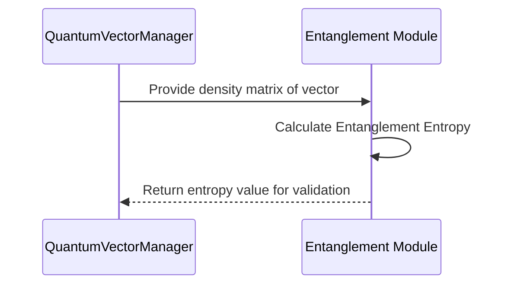
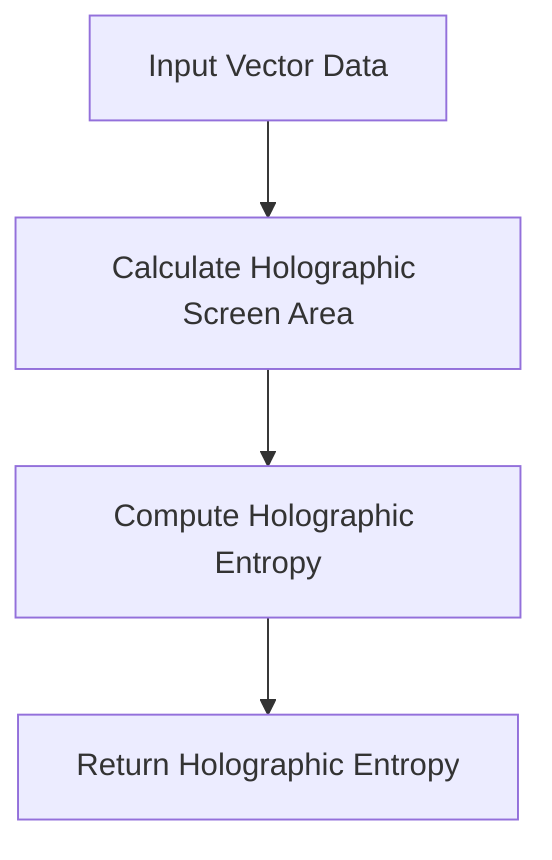
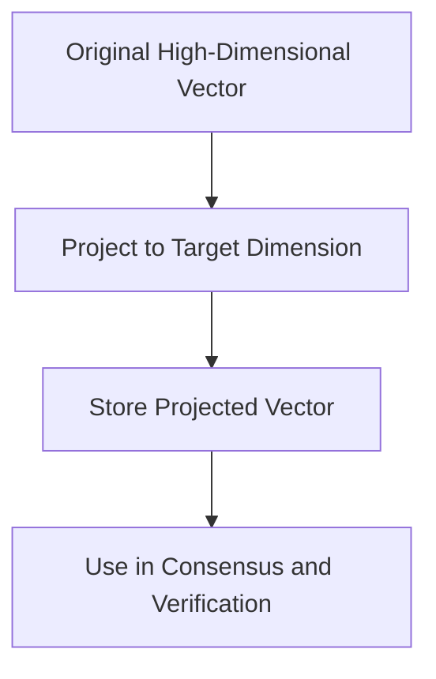
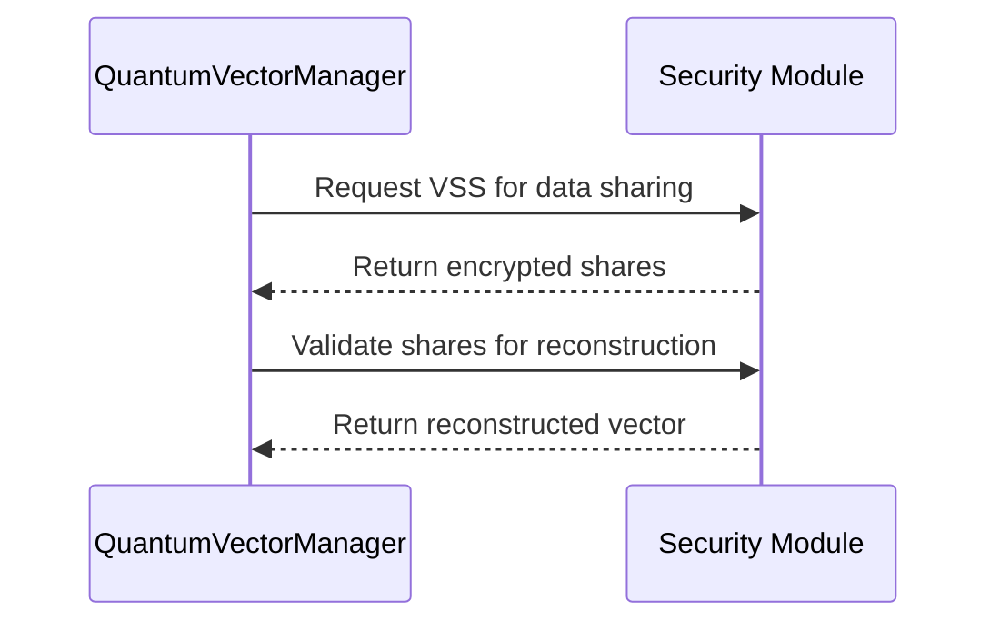
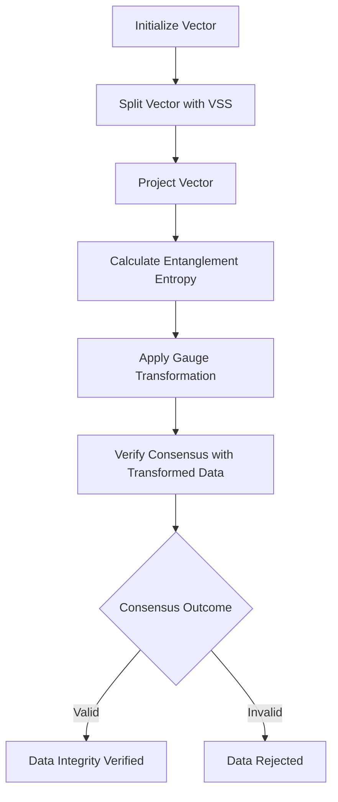

# Multiverse Concept in Decentralized Systems

The `multiverse` concept introduces a layered approach to managing, transforming, and verifying complex vector data in a decentralized system. This architecture enables secure, scalable, and multi-dimensional processing by dividing responsibilities across specialized components within the `multiverse` namespace. Each module within `multiverse` (e.g., `consensus`, `entanglement`, `holography`, `projection`, and `security`) contributes a unique function to the overall goal of managing secure, decentralized transactions in the network.

The multiverse framework works by integrating these modules to:
1. Apply transformations and projections on vector data.
2. Secure data through encryption and secret sharing.
3. Measure vector coherence and reliability with entanglement and holographic entropy.
4. Achieve distributed consensus on data integrity across nodes.

## Module Structure

```plaintext
multiverse
├── consensus
├── entanglement
├── holography
├── projection
└── security
```

Each module plays a role in different stages of vector processing, from transformation to verification.

---

## 1. Consensus Module

The `consensus` module handles the verification of vector data across nodes, ensuring consistency in a decentralized manner. It utilizes gauge transformations for data encoding, followed by validation checks to ensure the integrity of transformed data.

### Workflow Diagram



### Key Components

- **Gauge Transformation**: Applies a secure transformation to the vector data, protecting it against unauthorized access during transmission.
- **Consensus Verification**: Ensures that data integrity is preserved across nodes by comparing transformed data with the original vector.

---

## 2. Entanglement Module

The `entanglement` module computes **entanglement entropy** to measure the coherence between different layers of vector data. Entanglement entropy is essential for verifying inter-layer correlation, which helps in detecting anomalies or inconsistencies.

### Entanglement Workflow



### Key Components

- **Density Matrix Calculation**: Forms the density matrix from the vector coordinates to represent its quantum state.
- **Entropy Calculation**: Uses the density matrix to compute entanglement entropy, which quantifies the degree of coherence within the vector.

---

## 3. Holography Module

The `holography` module calculates **holographic entropy** to evaluate redundancy and resilience of vector data. This entropy is used as a measure of the system’s fault tolerance and data redundancy, particularly valuable for high-reliability applications.

### Holographic Entropy Calculation



### Key Components

- **Holographic Screen**: A theoretical boundary within the data space that helps compute entropy based on vector projection.
- **Entropy Measurement**: Calculates holographic entropy based on the data’s projection area, useful for assessing resilience and data redundancy.

---

## 4. Projection Module

The `projection` module handles dimensional transformations, allowing vectors to be projected into different target dimensions as needed. This module is crucial for simplifying high-dimensional data while preserving essential features.

### Projection Workflow



### Key Components

- **Dimensional Projection**: Reduces the dimensionality of a vector, which is useful for storage optimization and computation efficiency.
- **Projection Consistency**: Ensures that the projection accurately represents the original vector in the target dimension.

---

## 5. Security Module

The `security` module provides cryptographic protections and data transformations to ensure the confidentiality and integrity of vector data. It includes cryptographic primitives such as key exchange, secret sharing (VSS), and signature schemes.

### Security Workflow



### Key Components

- **Verifiable Secret Sharing (VSS)**: Splits the vector data into encrypted shares, enabling distributed storage with a threshold scheme for reconstruction.
- **Signature Verification**: Uses cryptographic signatures to authenticate data integrity and protect against tampering.

---

## End-to-End Process Overview

The following diagram shows the full flow from vector creation to consensus verification in the multiverse environment.



---

## Example Scenarios

### Scenario 1: High-Reliability Vector Creation

1. **Vector Initialization**: A new vector is created with high-reliability parameters.
2. **Holographic Entropy Check**: The `holography` module verifies data redundancy.
3. **Secure Consensus Verification**: The vector undergoes consensus verification with minimal tolerance for data transformation errors.

### Scenario 2: Secure Data Sharing in Adversarial Environment

1. **Vector Splitting with VSS**: A vector’s coordinates are split and encrypted using VSS.
2. **Layer Entanglement Verification**: Entanglement entropy confirms the coherence of shared data layers.
3. **Secure Consensus Layer**: The system validates the transformed data against original vectors, ensuring authenticity.

---

## Conclusion

The `multiverse` architecture provides a robust framework for managing, securing, and verifying vector data in a decentralized environment. Each module—`consensus`, `entanglement`, `holography`, `projection`, and `security`—plays a critical role in maintaining data integrity, security, and coherence. Through a combination of cryptographic techniques and quantum-inspired algorithms, the system achieves high reliability and security suitable for distributed applications.