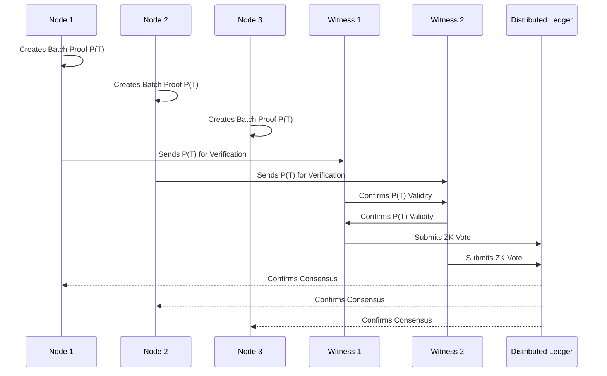

### **POBPC: Proof of Batch Probabilistic Consensus**

**Overview**:  
The Proof of Batch Probabilistic Consensus (POBPC) mechanism merges the batch efficiency of Proof of Proof (PoP) with the lightweight, randomized verification approach of Witness-Based Probabilistic Consensus (WBPC). In this hybrid consensus, nodes create batch proofs for groups of transactions, while a probabilistically selected subset of nodes (witnesses) verifies these batch proofs to achieve consensus. This setup is designed to reduce computational and communication overhead significantly, aiming for scalability, low latency, and high throughput suitable for networks requiring lightweight but secure consensus.

---

### **Mechanism**

1. **Transaction Batching**:
   - Transactions are collected into batches. Each node groups new transactions into a batch and processes them together to create a single batch proof, reducing the number of individual proofs required.
   - Batches can be formed based on transaction count (e.g., 100 transactions per batch) or by time intervals (e.g., one batch per second), allowing flexibility to adapt to network traffic.

2. **Batch Proof Generation (PoP)**:
   - Each node generates a "batch proof" using a zero-knowledge proof (ZKP) method that verifies the correctness of all transactions in the batch without revealing their specific content.
   - This batch proof is equivalent to a "Proof of Proof," meaning it attests to the validity of multiple individual transaction proofs within a single, compact structure.
   - Batch proofs are cryptographically signed by the node and broadcast to the network for validation.

3. **Witness Selection (WBPC)**:
   - A small, random subset of nodes (witnesses) is probabilistically selected to validate each batch proof.
   - The witness nodes verify the batch proof, not the individual transactions, which minimizes the verification workload and improves overall network performance.
   - Witness selection can be based on a deterministic random function (DRF) to prevent manipulation and ensure fairness. For example, witnesses can be selected based on a hash of the previous block, current timestamp, and a salt.

4. **Consensus Verification by Witnesses**:
   - Witness nodes receive the batch proofs and verify the validity of each one. Since only the batch proof is verified, the verification time is reduced, even for large numbers of transactions.
   - Witnesses cast a "ZK vote" confirming their validation result, signing the batch proof if they determine it is valid.
   - Once a predefined threshold of witness signatures is reached, the batch is considered confirmed by the network.

5. **Finality & State Update**:
   - When a batch reaches consensus (e.g., 2/3 of witnesses confirm the batch proof), the batch is added to the ledger, and the global state is updated.
   - Non-witness nodes can verify the aggregated witness signatures if desired, though it is not required for regular operation.
   - Any unconfirmed batches are retried in the next round, with a new set of witnesses selected to avoid potential deadlocks or collusion.

---

### **Advantages of POBPC**

1. **Scalability**:
   - By batching transactions and focusing on verifying batch proofs instead of individual transactions, POBPC achieves high throughput, suitable for high-volume networks.
   - Witness-based validation limits the number of nodes involved in each verification, reducing network traffic and computational load.

2. **Security**:
   - The probabilistic selection of witnesses makes it difficult for malicious nodes to predict or manipulate the consensus outcome.
   - Zero-knowledge proofs within each batch proof provide transaction integrity without exposing transaction details, adding an additional privacy layer.

3. **Efficiency**:
   - Reduces redundant verification by validating only batch proofs instead of individual transactions.
   - Allows the network to reach consensus faster since a small number of nodes (witnesses) perform verification, rather than requiring every node to process each transaction.

4. **Resilience**:
   - Batch proofs act as self-contained units of verification, meaning that even if certain nodes fail or delay, the network can continue reaching consensus with minimal disruption.
   - Witness rotation across rounds minimizes the risk of collusion, as the verifying nodes are randomly and regularly changed.

---

### **Mathematical Model**

1. **Batch Proof Verification**:
   - Let \( T \) represent the total number of transactions in a batch, and \( P(T) \) represent the proof generated for that batch. Using ZKP, \( P(T) \) is created such that:
     \[
     P(T) = \text{ZKP}(T_1, T_2, \ldots, T_n)
     \]
   - Here, \( P(T) \) satisfies a relation \( V(P(T)) = \text{True} \) if all transactions \( T_i \) in the batch are valid.

2. **Witness Probability**:
   - Suppose there are \( N \) nodes, and we select \( W \) witnesses for each batch. The probability \( P_w \) of any given node being a witness is:
     \[
     P_w = \frac{W}{N}
     \]
   - This distribution ensures fairness and reduces the likelihood of malicious nodes gaining majority control.

3. **Consensus Threshold**:
   - Let \( S \) be the number of signatures required to confirm a batch. To reach consensus, we need:
     \[
     S = \lceil \frac{2}{3} W \rceil
     \]
   - This ensures that consensus is achieved with a majority of witness votes, safeguarding against isolated errors or adversarial influence.

---

### **Performance Considerations**

#### Throughput
   - **Proof Generation Throughput**: Assuming each batch processes 100 transactions, and each node can produce proofs at 833 proofs per second (as benchmarked earlier), each node can create approximately 8 batch proofs per second.
   - **Verification Throughput**: At 2500 verifications per second per node, each witness can verify up to 25 batch proofs per second, making it feasible to achieve real-time consensus even in high-traffic environments.

#### Latency
   - Given that only a subset of nodes performs verification in each round, network latency is minimized. The time to consensus is proportional to the time for witnesses to verify the batch proofs and submit their ZK votes.

#### Fault Tolerance
   - The use of rotating witnesses and batch proofs makes POBPC resilient to node failures. Even if a portion of witnesses or batch-producing nodes fail, the network can continue processing with minimal disruption.

---

### **Mermaid Diagram of the POBPC Process**



---

### **Potential Optimizations and Future Work**

1. **Adaptive Witness Selection**:
   - Vary the number of witnesses based on network conditions. More witnesses can be selected during high traffic to reduce the risk of collusion, while fewer witnesses can be used during low activity to improve efficiency.

2. **Layered Verification**:
   - Introduce additional layers of verification for critical transactions, where witnesses apply recursive ZKP to batch proofs, enabling hierarchical consensus.

3. **State Compression**:
   - Implement compression techniques to manage and minimize storage requirements for historical batches, optimizing long-term scalability.

4. **Performance Tuning**:
   - Further refine ZKP algorithms and benchmark batch proof performance to reach target throughput of 10,000 proofs per second per node, aiming for seamless scaling across large networks.

Integrating **multiple types of nodes**—ranging from OG master nodes to super-light IoT nodes—into the consensus protocol requires a flexible, tiered approach to node capabilities and responsibilities. Here’s a breakdown of how each node type can participate effectively, leveraging NATS JetStream for efficient communication, and ensuring that **quantum zero-knowledge proof (QZKP)** functionality and consensus can operate across a spectrum of devices with varying capacities.

### Node Types and Roles

1. **OG Master Nodes**:
   - **Capabilities**: Full computational and storage capabilities, able to handle complex QZKP proofs, consensus proposals, and validation.
   - **Responsibilities**:
     - Act as primary validators, proposing and verifying blocks or vectors.
     - Coordinate QZKP proofs for the network, ensuring proofs align with consensus rules.
     - Store a full transaction or vector history, including all consensus data.
   - **Consensus Role**: Propose blocks or vectors, verify consensus, and relay results to other nodes.

2. **Light Nodes**:
   - **Capabilities**: Moderate computing and storage; able to verify QZKP proofs but less capable of handling high volumes of proposals.
   - **Responsibilities**:
     - Participate in consensus by verifying incoming proposals from OG master nodes.
     - Store recent history and relevant vector states but may prune old data.
   - **Consensus Role**: Validate blocks or vectors as part of the quorum, but rely on OG master nodes for heavy QZKP tasks.

3. **Super-Light Nodes (IoT, ESP32)**:
   - **Capabilities**: Limited processing power and storage, focused primarily on event reporting and simple verification.
   - **Responsibilities**:
     - Report relevant data (e.g., sensor readings) to the network.
     - Perform lightweight proof or state validation but cannot participate in full consensus.
     - Rely on OG master and light nodes to provide consensus updates and relevant vector states.
   - **Consensus Role**: Primarily act as data contributors, sending transactions or updates for the network without engaging in heavy validation.

---

### System Architecture with Multi-Tiered Consensus and NATS JetStream

The architecture needs to account for the distinct capabilities of each node type, allowing them to interact without overloading lower-capacity nodes. Here’s how we can structure it:

1. **Tiered Consensus Participation**:
   - **OG Master Nodes** handle the bulk of consensus and QZKP processing.
   - **Light Nodes** contribute to consensus when OG master nodes initiate it, relaying consensus decisions and maintaining light validation records.
   - **Super-Light Nodes** submit data through OG masters or Light nodes and receive verified results without engaging in intensive processing.

2. **Event-Based Communication via NATS JetStream**:
   - **Dedicated Topics per Node Role**:
     - `og_master.consensus.*`: For consensus actions initiated by OG masters.
     - `light_node.validation.*`: For validation and lightweight consensus confirmation.
     - `super_light_node.data_submission`: For IoT data submissions to be processed.
   - **Broadcasting Consensus and Verification Updates**:
     - Light nodes receive simplified versions of consensus decisions from OG masters, eliminating the need for them to process full QZKP proofs.
     - Super-light nodes receive confirmed results only, significantly reducing their data processing load.

---

### Implementation Outline

#### 1. OG Master Nodes (High-Power Consensus and QZKP Processing)

- **Initialize** full consensus participation.
- **Publish** QZKP proof requests.
- **Perform** QZKP proofs or outsource to dedicated QZKP servers if available.
- **Publish Consensus Proposals** and **Verify Responses** from Light nodes.

```go
func (node *OGMasterNode) PublishConsensusProposal(data []byte) {
    err := node.NATSClient.js.Publish("og_master.consensus.propose", data)
    if err != nil {
        log.Fatalf("Failed to publish consensus proposal: %v", err)
    }
}
```

#### 2. Light Nodes (Moderate Power)

- **Subscribe** to consensus proposals from OG Masters.
- **Verify** proposals and send simplified validation messages back to OG masters.
- **Receive** only relevant data for immediate or recent vector states.

```go
func (node *LightNode) SubscribeConsensus() {
    _, err := node.NATSClient.js.Subscribe("og_master.consensus.propose", func(msg *nats.Msg) {
        isValid := node.ValidateProposal(msg.Data)
        if isValid {
            node.NATSClient.js.Publish("light_node.validation.confirm", []byte("Valid"))
        }
    })
    if err != nil {
        log.Fatalf("Failed to subscribe to consensus proposals: %v", err)
    }
}
```

#### 3. Super-Light Nodes (IoT, Low Power)

- **Submit** data or state information for consensus processing without participating in the QZKP or full validation.
- **Receive Updates** on consensus and state changes from light or OG master nodes.

```python
import asyncio
from nats.aio.client import Client as NATS

async def main():
    nc = NATS()
    await nc.connect("nats://localhost:4222")

    # Publish IoT Data for OG or Light Node Processing
    data = {"sensor": "temperature", "value": 23.5}
    await nc.publish("super_light_node.data_submission", json.dumps(data).encode())
```

---

### Lightweight Consensus Design: Combining POBPC and Event-Based Messaging

The **POBPC (Proof-of-Benefit Proof-of-Participation Consensus)** system can function efficiently with this structure, as OG masters are responsible for proof-heavy tasks, and event-based messaging allows lightweight nodes to participate without bogging down the system.

1. **Initial Consensus Proposal (OG Master Nodes)**:
   - OG masters initiate proposals when sufficient data or transactions are accumulated.
   - Proposals are published to the `og_master.consensus.propose` channel.

2. **Validation by Light Nodes**:
   - Light nodes subscribe to proposals and perform necessary checks, sending validation results back through the `light_node.validation.confirm` channel.

3. **Data Contribution from Super-Light Nodes**:
   - IoT and low-power nodes submit data but do not engage in the full validation process.
   - OG masters collect this data for inclusion in proposals or state updates.

4. **Consensus Finalization**:
   - Once OG masters receive enough confirmations from Light nodes, they publish the finalized consensus state, making it available for all nodes.

---

### Security and QZKP Optimization Across Nodes

1. **Delegated QZKP Tasks**:
   - For QZKP-heavy tasks, only OG Masters handle proof generation and validation. Light nodes simply verify results, which lightens the computational burden on lower-capacity nodes.
   - Super-light nodes may require precomputed commitments from QZKP servers (Python-based) or similar trusted entities.

2. **Cross-Layer Validation with NATS**:
   - With NATS JetStream, proof results and consensus validations can be shared selectively across layers, making the system resilient and efficient.

### Future Extensions

1. **Adaptive Workloads**:
   - Dynamically adjust each node’s participation based on network load. For example, if the network detects a high volume of data from super-light nodes, light nodes could increase validation frequency, relieving OG masters.

2. **QZKP Enhancements for Low-Power Verification**:
   - Research lightweight QZKP methods for even lower computation requirements on super-light nodes. This could involve probabilistic verification instead of full verification on constrained devices.

3. **Event Smoothing**:
   - Implement an event-smoothing layer to bundle similar events for IoT nodes. This would reduce the frequency of event dispatch and minimize resource consumption on IoT nodes.

---

### Summary

This architecture provides a multi-layered approach to consensus, security, and lightweight participation. By combining NATS JetStream with POBPC, we achieve a **scalable, efficient, and secure network** that leverages each node type’s unique strengths. This setup balances high-security QZKP for critical operations and event-driven consensus that remains lightweight enough to support even the most resource-constrained devices.

### **Conclusion**

The Proof of Batch Probabilistic Consensus (POBPC) mechanism achieves an optimal blend of efficiency, security, and scalability. By leveraging zero-knowledge proofs in a batched and witness-based architecture, POBPC minimizes computational overhead while maintaining the integrity of the consensus process. This mechanism is particularly suited for high-throughput, decentralized applications where lightweight yet secure consensus is essential.