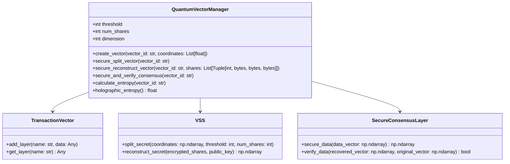
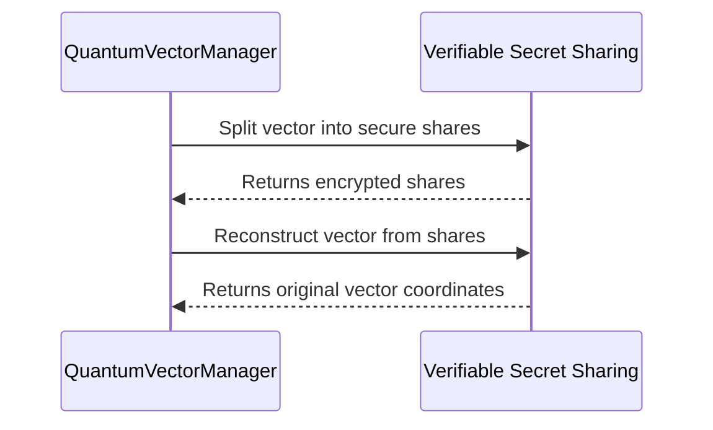
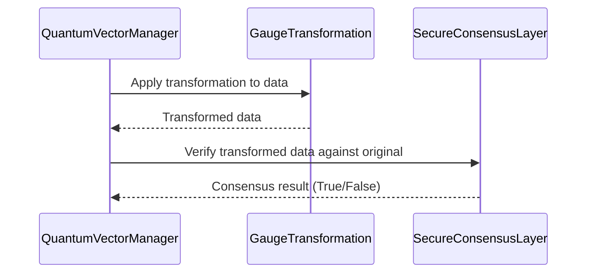
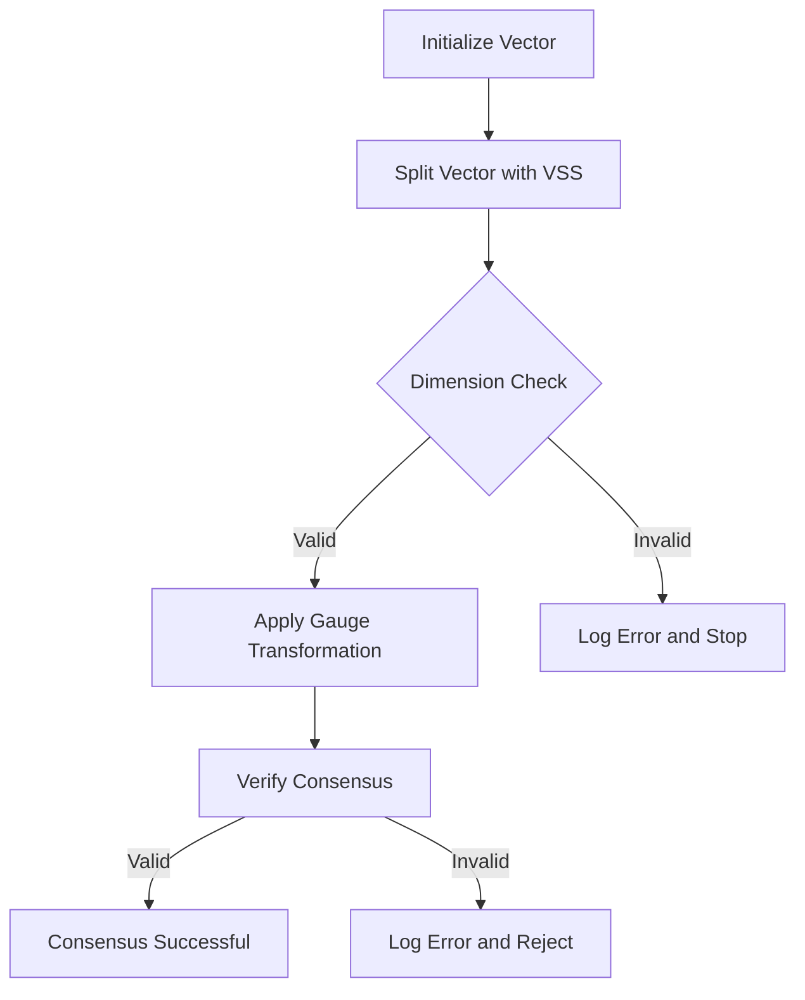

# Quantum Vector Transaction and Consensus Process

## Overview

The system is built around a decentralized, quantum-inspired architecture that securely manages vectors (multi-dimensional data points) through transactions and consensus mechanisms. The `QuantumVectorManager` class facilitates the creation, modification, and verification of vectors, integrating multiple components like `TransactionVector`, `TransactionLayer`, `VSS`, and `SecureConsensusLayer`.

The process flow includes:
1. **Transaction Creation**: Creating vectors and storing their state with cryptographic guarantees.
2. **Secure Secret Sharing**: Splitting vector data securely with VSS for distributed storage.
3. **Vector Reconstruction and Entanglement**: Reconstructing vectors from shares and computing entanglement entropy for verification.
4. **Consensus Mechanism**: Using secure consensus to validate vector integrity and transformations.

## Process Components

### 1. Transaction Vector

The `TransactionVector` class represents a vector object that holds multiple layers of data, such as coordinates, state, and cryptographic signatures. Each vector is unique and stored by an identifier (`vector_id`) in `QuantumVectorManager`.

### 2. Secure Vector Splitting with VSS

The Verifiable Secret Sharing (VSS) scheme is used to split a vector’s data securely into multiple shares, which can be distributed across different nodes. A threshold number of shares is required to reconstruct the vector, making the system resilient to data loss and tampering.

### 3. Entanglement and Holographic Entropy

The system calculates **entanglement entropy** to verify inter-layer correlation within a vector. Additionally, **holographic entropy** is computed to assess redundancy and resilience of the vector state.

### 4. Secure Consensus Layer

The `SecureConsensusLayer` ensures that consensus can be reached on the vector’s data without compromising security. Gauge transformations are applied to each vector, followed by verification to ensure the transformed data matches the original.

## Class Structure

### QuantumVectorManager Class Diagram



## Process Flow

### 1. Vector Creation and Layer Management

1. **Vector Creation**: `create_vector` initializes a vector with coordinates and state layers, normalizing the coordinates to ensure consistency.
2. **Layer Management**: Each vector can store multiple layers, such as `"Coordinates"`, `"State"`, or `"Signature"`. Layers are managed by `TransactionVector`.

#### Code Example

```python
vector = QuantumVectorManager.create_vector("vector_id", [0.3, 0.6, 0.8])
vector.add_layer("State", {"state": "SUPERPOSITION", "coherence": 1.0, "energy": 1.0, "timestamp": time.time()})
```

### 2. Secure Vector Splitting and Reconstruction

1. **Splitting with VSS**: Using `secure_split_vector`, the vector’s coordinates are split into multiple shares based on a predefined threshold. Each share is encrypted and signed.
2. **Reconstruction**: When needed, `secure_reconstruct_vector` combines enough shares to restore the original coordinates.

#### Flow Diagram



#### Code Example

```python
shares = QuantumVectorManager.secure_split_vector("vector_id")
reconstructed = QuantumVectorManager.secure_reconstruct_vector("vector_id", shares)
```

### 3. Entanglement Entropy Calculation

Entanglement entropy measures the correlation between layers in the vector, verifying data consistency. The density matrix of the vector’s coordinates is regularized to avoid singularities, then passed to `EntanglementEntropy.calculate_entropy`.

#### Code Example

```python
entropy = QuantumVectorManager.calculate_entropy("vector_id")
print(f"Entanglement Entropy: {entropy}")
```

### 4. Secure Consensus Process

To ensure vector data integrity, `QuantumVectorManager` uses gauge transformations and secure consensus mechanisms.

1. **Gauge Transformation**: The vector’s data is transformed by `GaugeTransformation` for secure verification.
2. **Consensus Verification**: `SecureConsensusLayer` verifies that the transformed data matches the original data within an allowable tolerance.

#### Flow Diagram



#### Code Example

```python
secured_data, is_valid = QuantumVectorManager.secure_and_verify_consensus("vector_id")
print(f"Consensus Validity: {is_valid}")
```

## Example Scenarios

### Scenario 1: High-Dimension Vector with Invalid Reconstruction

1. **Vector Creation**: A 5-dimensional vector is created, violating the expected 3-dimensional format.
2. **Error Handling**: `secure_split_vector` raises an error, halting the process due to the dimension mismatch.

### Scenario 2: Secure Consensus Verification with Perturbations

1. **Vector Creation and Transformation**: A vector undergoes slight perturbations.
2. **Consensus Check**: `verify_data` detects the mismatch, rejecting the perturbed vector to ensure integrity.

## Consensus Process Flow with Error Handling



## Conclusion

The `QuantumVectorManager`’s transaction and consensus process ensures that vectors are created, split, reconstructed, and verified in a secure and consistent manner. By integrating VSS, entanglement entropy, and a secure consensus layer with gauge transformations, this system maintains high levels of reliability and robustness, even in distributed and adversarial environments. The recent dimension handling improvements enhance this reliability, preventing mismatches that could lead to security vulnerabilities.