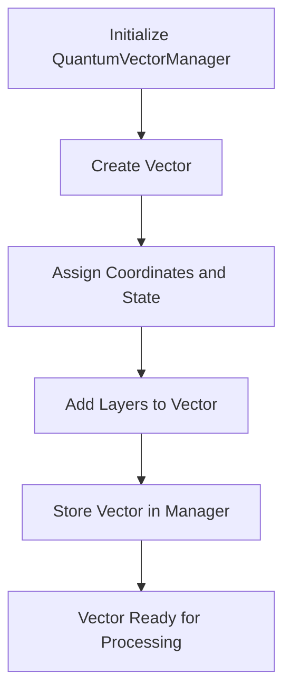
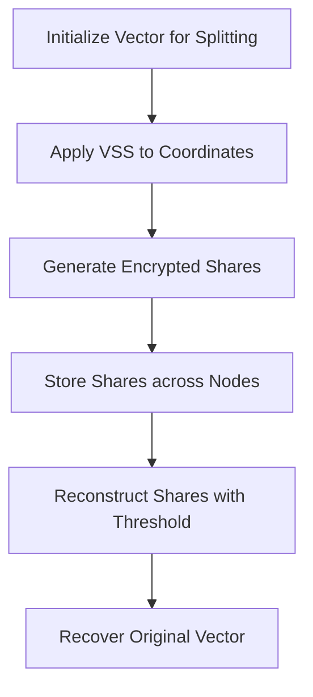
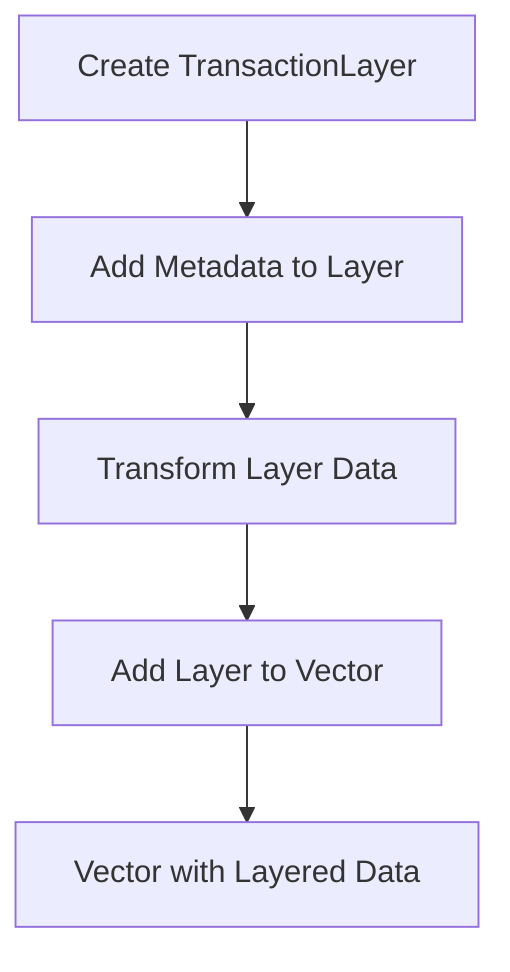
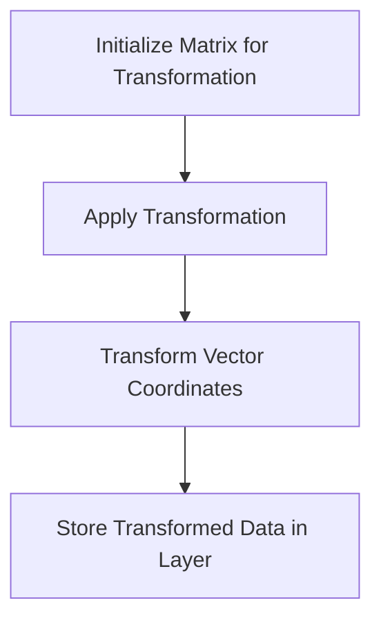
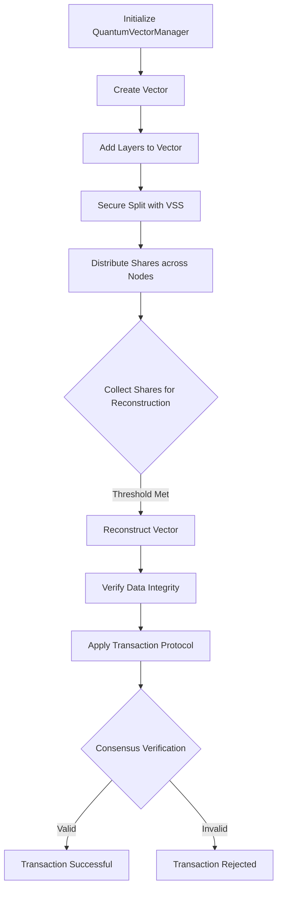

# Vector Module Documentation

The `vector_module` is the core component for handling vector-based operations within the system. It provides a structured approach to managing, transforming, and securely handling vectors that represent transaction data. Key functionalities include vector management, secret sharing, matrix operations, and layer transformations. This module facilitates secure and efficient handling of vectors in decentralized applications, enabling reliability and integrity through cryptographic techniques.

## Module Structure

```plaintext
vector_module
├── __init__.py
├── main.py
├── quantum_vector_manager.py
├── rle_utils.py
├── transaction_layer.py
├── transaction_matrix.py
├── transaction_protocol.py
├── transaction_vector.py
├── vectors_and_matrixes.md
└── vss_utils.py
```

---

## Module Overview

Each file in the `vector_module` serves a specific purpose in the processing and security of vector data:

1. **`quantum_vector_manager.py`**: Manages vector creation, secure splitting, and reconstruction. It coordinates interactions between different layers of the module to ensure vector integrity and security.
2. **`transaction_vector.py`**: Represents individual vectors with attributes, including coordinates and state information, and provides methods for adding layers to vectors.
3. **`transaction_matrix.py`**: Defines matrix structures that support vector transformations and complex operations.
4. **`transaction_layer.py`**: Manages individual layers within a vector, allowing layered transformations and additional metadata storage.
5. **`vss_utils.py`**: Provides verifiable secret sharing (VSS) functions for secure splitting and reconstruction of vector data.
6. **`transaction_protocol.py`**: Defines protocols for transaction handling, ensuring secure data transmission and validation across nodes.
7. **`rle_utils.py`**: Utility functions for compression using Run-Length Encoding (RLE) to reduce vector data size when stored or transmitted.

---

## Key Workflows

### 1. Vector Creation and Management

The `quantum_vector_manager.py` is the main class that handles vector creation and management. It creates vectors with unique IDs, initializes their layers, and performs secure transformations.



### 2. Secure Splitting and Reconstruction

The `vss_utils.py` module provides VSS functionality, allowing vectors to be split into multiple shares for distributed storage. Shares are encrypted and can be reconstructed if the threshold is met.



#### Steps

1. **Split Vector**: The vector’s coordinates are split using VSS, creating multiple encrypted shares.
2. **Distribute Shares**: Shares are distributed across nodes for secure storage.
3. **Reconstruct with Threshold**: The original vector is reconstructed only if enough shares are collected.

### 3. Layered Transformation

The `transaction_layer.py` provides support for adding and transforming individual layers in a vector. Layers can contain different types of data, allowing multiple transformations within a single vector.



### 4. Matrix Operations

`transaction_matrix.py` provides matrix operations for vectors, enabling advanced transformations like rotations, scaling, and dimensional reduction. This is particularly useful for quantum-inspired vector transformations.



---

## Example Scenarios

### Scenario 1: Secure Vector Creation and Storage

1. **Vector Creation**: A vector is initialized with specific coordinates and state information.
2. **VSS Split**: The vector’s data is split into encrypted shares using `vss_utils.py`.
3. **Layered Data Addition**: Different layers are added to the vector, each with its own metadata and transformations.
4. **Secure Storage**: Shares are distributed across nodes for secure storage.

### Scenario 2: Data Recovery from Partial Shares

1. **Share Collection**: Nodes collect shares of a vector.
2. **Threshold Met**: Once the minimum threshold of shares is met, reconstruction begins.
3. **Vector Reconstruction**: Using VSS, the original vector is reconstructed with its layers intact.

---

## Documentation of Files and Functions

### `quantum_vector_manager.py`

This file contains the main class `QuantumVectorManager`, responsible for managing vectors and coordinating various operations.

- **`create_vector`**: Initializes a new vector with specified coordinates and assigns a unique ID.
- **`secure_split_vector`**: Uses VSS to split vector coordinates into encrypted shares.
- **`secure_reconstruct_vector`**: Reconstructs the original vector from shares if the threshold is met.

### `transaction_vector.py`

Defines the `TransactionVector` class, which holds the data for each vector.

- **`add_layer`**: Adds a new layer to the vector, storing additional information.
- **`get_layer`**: Retrieves data for a specific layer within the vector.

### `vss_utils.py`

Contains VSS functions to split and reconstruct vector data securely.

- **`split_secret`**: Splits a vector into multiple encrypted shares.
- **`reconstruct_secret`**: Reconstructs the vector from a set of shares.

### `transaction_protocol.py`

Defines protocols for handling transaction data.

- **`validate_transaction`**: Ensures data integrity across nodes.
- **`encrypt_transaction`**: Encrypts transaction data for secure transmission.

---

## Overall Process Flow

The following diagram shows the end-to-end process flow within the `vector_module`, from vector creation to secure storage and consensus verification.



---

## Conclusion

The `vector_module` is designed to handle complex vector operations securely and efficiently in a decentralized environment. By combining VSS for secure storage, matrix transformations for advanced data manipulation, and layered data management, the module achieves a high level of reliability and scalability for handling sensitive transaction data in distributed systems.

This modular approach enables flexibility and robustness, allowing the system to meet diverse requirements such as secure storage, data transformation, and consensus verification. Each component plays a unique role in ensuring that vectors and transactions are managed securely and consistently across the network.